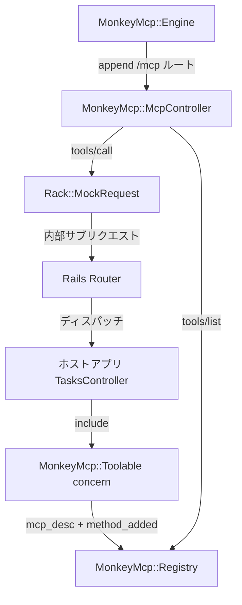
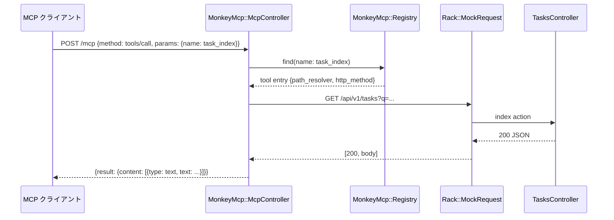
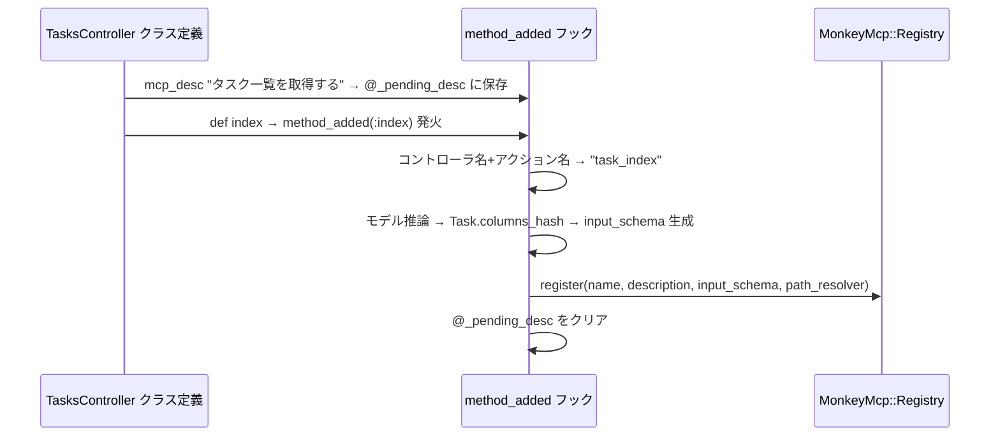

# Design Document — mcp-server-gem

## Overview

本機能は `my_task_app` に直接実装されている MCP (Model Context Protocol) サーバコードを、独立した Ruby Gem `monkey_mcp` として抽出・抽象化する。Gem を Gemfile に追加するだけで Rails アプリに MCP サーバ機能が自動的に組み込まれ、コントローラのアクションが MCP ツールとして自動登録される。

**Purpose**: Rails 開発者が MCP プロトコルの実装詳細を意識せずに、コントローラへの最小限の記述で MCP ツールを提供できるようにする。

**Users**: `monkey_mcp` Gem を利用する Rails 開発者が、既存のコントローラに `include MonkeyMcp::Toolable` と `mcp_desc` を追加するだけで MCP エンドポイントを提供できるワークフローを対象とする。

**Impact**: `my_task_app` 内の `McpController`・`McpToolable` concern・initializer を Gem に移植し、アプリ側のコード量を大幅に削減する。

### Goals

- `include MonkeyMcp::Toolable` だけで routes に存在する `controller#action` の public メソッドを MCP ツールとして自動登録する
- `input_schema` を ActiveRecord カラム定義から自動生成し、手動定義を不要にする
- `mcp_desc` デコレータで description を最小コストで記述できるようにする
- `my_task_app` の既存 `mcp_spec.rb` テストを変更なしでパスさせる

### Non-Goals

- 非 Rails（Sinatra・Hanami 等）への対応
- GraphQL・REST 以外のトランスポートへの対応
- `input_schema` の完全な型推論（カスタム validation の自動反映等）
- MCP クライアントの実装

## Architecture

### Existing Architecture Analysis

現在の `my_task_app` では以下の 3 ファイルが MCP 機能を担っている：

- `app/controllers/mcp_controller.rb` — JSON-RPC 2.0 ディスパッチャ、内部サブリクエスト発行
- `app/controllers/concerns/mcp_toolable.rb` — ツール登録 DSL（`mcp_tool`）とグローバルレジストリ
- `config/initializers/mcp_tools.rb` — コントローラの eager load と内部トークン生成
- `config/routes.rb` — `post "mcp", to: "mcp#handle"` の手動定義

これらをすべて Gem 内に移動し、ホストアプリは `include MonkeyMcp::Toolable` と `mcp_desc` のみを記述する形に変える。

### Architecture Pattern & Boundary Map



**Architecture Integration**:
- 選択パターン: Rails::Engine（詳細は `research.md` の Architecture Pattern Evaluation を参照）
- ドメイン境界: Gem はプロトコル処理・登録 DSL・スキーマ生成を担当。ビジネスロジックはホストアプリのコントローラに留まる
- 既存パターンの維持: `Rack::MockRequest` による内部サブリクエストパターンをそのまま踏襲
- Steering compliance: Rails の Concern パターン・Engine パターンに準拠

### Technology Stack

| Layer | Choice / Version | Role in Feature | Notes |
|-------|------------------|-----------------|-------|
| Backend | Ruby 3.4.3 / Rails 8.1.2 | Gem のランタイム環境 | ホストアプリのバージョンに追従 |
| Gem 基盤 | Rails::Engine | ルート・コントローラ・initializer の自動提供 | Railtie のサブクラス |
| スキーマ生成 | ActiveRecord columns_hash / defined_enums | input_schema の自動生成 | 実行時に参照、DB 接続が必要 |
| プロトコル | MCP 2024-11-05 / JSON-RPC 2.0 | MCPメッセージ処理 | 現行実装と同バージョン |
| 内部通信 | Rack::MockRequest | ツール呼び出しの内部ディスパッチ | 既存パターンを踏襲 |

## System Flows

### tools/call フロー



### `mcp_desc` + `method_added` によるツール登録フロー



## Requirements Traceability

| Requirement | Summary | Components | Interfaces | Flows |
|-------------|---------|------------|------------|-------|
| 1.1–1.9 | ツール自動登録 | Toolable, Registry | `mcp_desc`, `method_added` | 登録フロー |
| 2.1–2.6 | JSON-RPC 2.0 処理 | McpController | `handle` | tools/call フロー |
| 3.1–3.4 | Engine 組み込み | Engine | routes, initializer | — |
| 4.1–4.9 | 内部サブリクエスト | McpController | `internal_dispatch` | tools/call フロー |
| 5.1–5.7 | 設定・カスタマイズ | Configuration | `MonkeyMcp.configure` | — |
| 6.1–6.4 | 後方互換性 | 全コンポーネント | — | — |

## Components and Interfaces

| Component | Domain/Layer | Intent | Req Coverage | Key Dependencies | Contracts |
|-----------|--------------|--------|--------------|-----------------|-----------|
| MonkeyMcp::Engine | Infrastructure | ルート・initializer の自動提供 | 3.1–3.4 | Rails::Engine (P0) | — |
| MonkeyMcp::Toolable | DSL / Concern | `mcp_desc` + `method_added` でツール自動登録 | 1.1–1.9 | Registry (P0), ActiveRecord (P0) | Service |
| MonkeyMcp::Registry | Domain | ツール定義のグローバルストア | 1.3, 1.6, 1.7, 5.6 | — | Service |
| MonkeyMcp::SchemaBuilder | Domain | ActiveRecord → JSON Schema 変換 | 1.3 | ActiveRecord::Base (P0) | Service |
| MonkeyMcp::McpController | API | JSON-RPC 2.0 ディスパッチ・内部サブリクエスト | 2.1–2.6, 4.1–4.9 | Registry (P0), Rack (P0) | API |
| MonkeyMcp::Configuration | Config | Gem 設定の保持・提供 | 5.1–5.7 | — | State |

### Infrastructure Layer

#### MonkeyMcp::Engine

| Field | Detail |
|-------|--------|
| Intent | Rails::Engine としてホストアプリ routes へ /mcp を自動 append し、initializer でコントローラを事前ロードする |
| Requirements | 3.1, 3.2, 3.3, 3.4, 3.5, 3.6 |

**Responsibilities & Constraints**
- `config.after_initialize` で `MonkeyMcp.configuration.auto_append_route` が `true` の場合のみ、`app.routes.append` で `post MonkeyMcp.mount_path` を追加する
- ルート追加前に既存ルートを検査し、同一 verb/path/controller のエントリがある場合は append をスキップする
- `to_prepare` ではルート追加処理を実行しない（route reload 時の重複防止）
- `to_prepare` では `MonkeyMcp::Registry.reset!` を先に実行してから対象コントローラを preload し、reload 時の二重登録を防止する
- `to_prepare` ブロックで `MCP_INTERNAL_TOKEN` を生成し、ホストアプリのコントローラを eager load

**Dependencies**
- Inbound: ホストアプリ Gemfile — Gem を追加することで自動起動 (P0)
- Outbound: MonkeyMcp::Configuration — マウントパス取得 (P0)

**Contracts**: Service [x]

##### Service Interface
```ruby
module MonkeyMcp
  class Engine < ::Rails::Engine
    # auto_append_route=true のとき host app routes へ /mcp を append する
    # マウントパスは MonkeyMcp.mount_path で変更可能（デフォルト: "/mcp"）
  end
end
```

**Implementation Notes**
- `isolate_namespace` は使用しない（ホストアプリのルートに直接追加）
- `auto_append_route` を `false` にした場合はホストアプリ側で手動ルート定義を行う
- Risks: ルート追加がホストアプリのルートと競合する可能性 → `mount_path` 変更または `auto_append_route=false` で回避

### DSL Layer

#### MonkeyMcp::Toolable

| Field | Detail |
|-------|--------|
| Intent | `include` するだけで routes に存在する `controller#action` の public メソッドを MCP ツールとして自動登録する Concern |
| Requirements | 1.1, 1.2, 1.3, 1.4, 1.5, 1.6, 1.7, 1.8, 1.9 |

**Responsibilities & Constraints**
- `method_added` フックで public メソッド定義を検知し、routes に存在する `controller#action` のみ自動登録を実行
- `mcp_desc` で指定された description を次の `method_added` 発火時に消費
- コントローラ名・アクション名から tool name, path, HTTP method を自動解決
- `SchemaBuilder` に委譲して `input_schema` を生成
- `MonkeyMcp.configuration.excluded_tool_methods` に含まれるメソッドは自動登録対象から除外
- routes に存在しない public メソッドは登録せず `Rails.logger.warn` を出力

**Dependencies**
- Outbound: MonkeyMcp::Registry — ツール登録 (P0)
- Outbound: MonkeyMcp::SchemaBuilder — スキーマ生成 (P0)
- Outbound: MonkeyMcp::Configuration — 除外設定の参照 (P0)
- External: ActionController::Base — コントローラクラスメソッド群 (P0)

**Contracts**: Service [x]

##### Service Interface
```ruby
module MonkeyMcp
  module Toolable
    extend ActiveSupport::Concern

    class_methods do
      # アクション直前に呼び出して description を設定するデコレータ
      # @param desc [String] ツールの説明文
      def mcp_desc(desc)
        @_pending_mcp_desc = desc
      end

      # method_added フック: アクション定義時に自動登録
      # @param method_name [Symbol] 定義されたメソッド名
      def method_added(method_name)
        super
        # private/protected/継承メソッド/設定で除外されたメソッドは除外
        # routes に存在しない controller#action は登録せず warning
        return unless action_methods_candidate?(method_name)

        MonkeyMcp::Registry.register(
          controller_class: self,
          action: method_name,
          description: @_pending_mcp_desc || ""
        )
        @_pending_mcp_desc = nil
      end
    end
  end
end
```
- Preconditions: `include MonkeyMcp::Toolable` がコントローラクラスで呼ばれていること
- Postconditions: アクションに対応するツールが Registry に登録されていること
- Invariants: `@_pending_mcp_desc` は `method_added` 発火後に必ずクリアされる

**Implementation Notes**
- Integration: Rails のコントローラ autoload 後に `method_added` が発火する前提
- Validation: `action_methods_candidate?` で `private`, `protected`, 継承メソッド, 設定除外メソッド, routes 未定義メソッドを除外
- Risks: コントローラ継承時に親クラスのアクションが重複登録される可能性 → Registry 側で重複チェック

### Domain Layer

#### MonkeyMcp::Registry

| Field | Detail |
|-------|--------|
| Intent | 登録済み MCP ツールのグローバルストア。登録・検索・一覧取得を提供する |
| Requirements | 1.3, 1.6, 1.7 |

**Responsibilities & Constraints**
- スレッドセーフなツール一覧の保持（Rails 起動時にクラスロードで登録されるため写像は不変）
- ツール名の重複検出と警告

**Dependencies**
- Inbound: Toolable — ツール登録 (P0)
- Inbound: McpController — ツール一覧・検索 (P0)

**Contracts**: Service [x]

##### Service Interface
```ruby
module MonkeyMcp
  module Registry
    MUTEX = Mutex.new

    # ツールを登録する
    # @param controller_class [Class] コントローラクラス
    # @param action [Symbol] アクション名
    # @param description [String] ツールの説明文
    def self.register(controller_class:, action:, description:)
      MUTEX.synchronize do
        # tool_name, input_schema, path_resolver を解決して追加
      end
    end

    # 登録済みツール一覧を返す
    # @return [Array<Hash>] {name:, description:, inputSchema:, path_resolver:, http_method:}
    def self.all
      MUTEX.synchronize { @tools ||= [] }
    end

    # ツール名でツールを検索する
    # @param name [String]
    # @return [Hash, nil]
    def self.find(name)
      MUTEX.synchronize { (@tools || []).find { |t| t[:name] == name } }
    end

    # レジストリをリセットする（テスト用）
    def self.reset!
      MUTEX.synchronize { @tools = [] }
    end
  end
end
```

#### MonkeyMcp::SchemaBuilder

| Field | Detail |
|-------|--------|
| Intent | ActiveRecord のカラム定義から JSON Schema (input_schema) を自動生成する |
| Requirements | 1.3 |

**Responsibilities & Constraints**
- `columns_hash` と `defined_enums` を参照して JSON Schema を生成
- `created_at`, `updated_at` 等のメタカラムを除外
- `show`, `update`, `destroy` では `id` を required に含める
- モデルが見つからない場合は空の schema を返し警告ログを出力

**Dependencies**
- Inbound: Registry — スキーマ生成要求 (P0)
- External: ActiveRecord::Base — `columns_hash`, `defined_enums` (P0)

**Contracts**: Service [x]

##### Service Interface
```ruby
module MonkeyMcp
  class SchemaBuilder
    EXCLUDED_COLUMNS = %w[created_at updated_at].freeze
    AR_TO_JSON_TYPE = {
      string: "string", text: "string", integer: "integer",
      boolean: "boolean", decimal: "number", float: "number",
      datetime: "string", date: "string"
    }.freeze

    # モデルクラスとアクション名から JSON Schema を生成する
    # @param model_class [Class] ActiveRecord モデルクラス
    # @param action [Symbol] アクション名（:index, :show, :create, :update, :destroy）
    # @return [Hash] JSON Schema オブジェクト
    def self.build(model_class:, action:)
    end
  end
end
```

- Preconditions: `model_class` が `ActiveRecord::Base` のサブクラスであること
- Postconditions: 有効な JSON Schema Hash を返すこと
- Invariants: `show/update/destroy` では `id` が常に required になる

### API Layer

#### MonkeyMcp::McpController

| Field | Detail |
|-------|--------|
| Intent | MCP (JSON-RPC 2.0) リクエストを受信し、ツール呼び出しを内部サブリクエストとして処理する |
| Requirements | 2.1–2.6, 4.1–4.9 |

**Responsibilities & Constraints**
- JSON-RPC 2.0 メソッド（`initialize`, `tools/list`, `tools/call`）のディスパッチ
- `Rack::MockRequest` による内部サブリクエストの発行
- `create/update` 相当アクションでは Strong Parameters 互換のため `arguments` を推論リソースキーでラップして送信
- 非 CRUD メソッドは routes の `controller#action` 一致から path + verb を探索して内部サブリクエスト先を解決
- CSRF 検証のスキップ
- `notifications/initialized` は通知として受理し、レスポンスボディなしで正常終了する

**Dependencies**
- Inbound: Engine routes — `/mcp` エンドポイント (P0)
- Outbound: Registry — ツール検索・一覧 (P0)
- External: Rack::MockRequest — 内部サブリクエスト (P0)

**Contracts**: API [x]

##### API Contract

| Method | Endpoint | Request | Response | Errors |
|--------|----------|---------|----------|--------|
| POST | /mcp | JSON-RPC 2.0 body | JSON-RPC 2.0 result | -32700, -32601, -32602 |

**Implementation Notes**
- Integration: 既存の `McpController` からほぼそのまま移植。`McpToolable.registry` → `MonkeyMcp::Registry.all` に変更
- Validation: `JSON::ParserError` を rescue して -32700 + HTTP 400 を返す
- Risks: 内部サブリクエスト時の認証トークン（`MCP_INTERNAL_TOKEN`）は Engine initializer で生成・管理

### Config Layer

#### MonkeyMcp::Configuration

| Field | Detail |
|-------|--------|
| Intent | Gem の設定値を保持し、`MonkeyMcp.configure` ブロックで変更できるようにする |
| Requirements | 5.1–5.7 |

**Dependencies**
- Inbound: Engine — mount_path 参照 (P0)
- Inbound: McpController — server_info, protocol_version 参照 (P0)

**Contracts**: State [x]

##### State Management
```ruby
module MonkeyMcp
  class Configuration
    attr_accessor :mount_path, :server_name, :server_version, :protocol_version, :auto_append_route, :excluded_tool_methods

    def initialize
      @mount_path       = "/mcp"
      @server_name      = "monkey_mcp"
      @server_version   = MonkeyMcp::VERSION
      @protocol_version = "2024-11-05"
      @auto_append_route = true
      @excluded_tool_methods = {}
    end
  end

  class << self
    def configure
      yield configuration
    end

    def configuration
      @configuration ||= Configuration.new
    end
  end
end
```

## Data Models

### Domain Model

本 Gem はデータベーステーブルを持たない。状態はすべてプロセスメモリ上のレジストリ（`MonkeyMcp::Registry.all`）に保持される。

**ToolEntry（Value Object）**:
```
name: String           # "task_index"
description: String    # "タスク一覧を取得する"
inputSchema: Hash      # JSON Schema
http_method: Symbol    # :get / :post / :patch / :delete
path_resolver: Proc    # (args) -> path_string
```

## Error Handling

### Error Strategy

JSON-RPC 2.0 のエラーコード規約に従い、エラーを JSON レスポンスとして返す。既存互換を優先し、`JSON::ParserError`（Parse error）のみ HTTP ステータスを 400 とし、それ以外の JSON-RPC エラーは HTTP 200 + error body とする。

### Error Categories and Responses

| エラー種別 | 条件 | JSON-RPC コード | 対応 |
|-----------|------|----------------|------|
| Parse error | 不正な JSON | -32700 | `JSON::ParserError` を rescue し HTTP 400 を返す |
| Method not found | 未知の MCP メソッド | -32601 | case 文で未知メソッドに対応 |
| Invalid params | 未知のツール名 | -32602 | Registry.find が nil |
| Tool error | 内部サブリクエストが 4xx/5xx | isError: true | ステータスコードで判定 |

### Monitoring

- 内部サブリクエストのステータスコードをログに記録
- `mcp_desc` 呼び出し後に対応アクションがない場合に `Rails.logger.warn` を出力

## Testing Strategy

### Unit Tests
- `MonkeyMcp::SchemaBuilder` — AR カラム型ごとの JSON Schema 変換、enum 変換、EXCLUDED_COLUMNS 除外
- `MonkeyMcp::Registry` — 登録・検索・重複検出・reset!
- `MonkeyMcp::Toolable` — `mcp_desc` + アクション定義で Registry に正しく登録されること
- `MonkeyMcp::Configuration` — デフォルト値・`configure` ブロックでの変更

### Integration Tests
- `MonkeyMcp::McpController` — `initialize` / `tools/list` / `tools/call` の各メソッドに対する JSON-RPC レスポンス検証
- 内部サブリクエストが正しいパス・HTTP メソッドで発行されること
- 不正 JSON・未知メソッド・未知ツール名に対するエラーレスポンス
- `create/update` 呼び出し時に `arguments` が推論リソースキー（例: `task`）でラップされること

### Regression Tests（既存）
- `spec/requests/mcp_spec.rb` — 既存テストを変更なしで全パス

## Security Considerations

- `MCP_INTERNAL_TOKEN` を Engine initializer でプロセス起動時に生成し、内部サブリクエストのヘッダーに付与する
- `MonkeyMcp.protect_with_internal_token!(BaseControllerClass)` を提供し、initializer で明示的に対象 API ベースコントローラへ内部トークン検証を適用できるようにする
- CSRF 検証は `McpController` でスキップ（`skip_before_action :verify_authenticity_token`）

## Migration Strategy

`my_task_app` への適用手順：

1. Gemfile に `gem 'monkey_mcp'` を追加
2. `app/controllers/mcp_controller.rb` を削除
3. `app/controllers/concerns/mcp_toolable.rb` を削除
4. `config/initializers/mcp_tools.rb` を削除
5. `MonkeyMcp.configure { |c| c.auto_append_route = true }` の場合は `config/routes.rb` の `post "mcp", to: "mcp#handle"` を削除（`false` の場合は手動ルートを維持）
6. `TasksController` の `include McpToolable` → `include MonkeyMcp::Toolable` に変更
7. 各 `mcp_tool(...)` ブロックを削除し、代わりに `mcp_desc "..."` をアクション直前に追加
8. テスト実行で既存 `mcp_spec.rb` が全パスすることを確認
